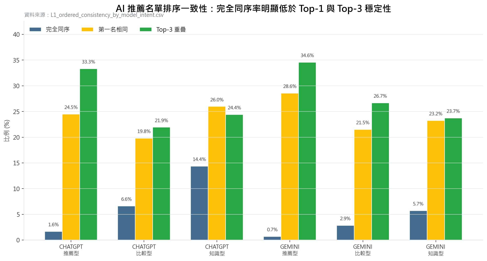
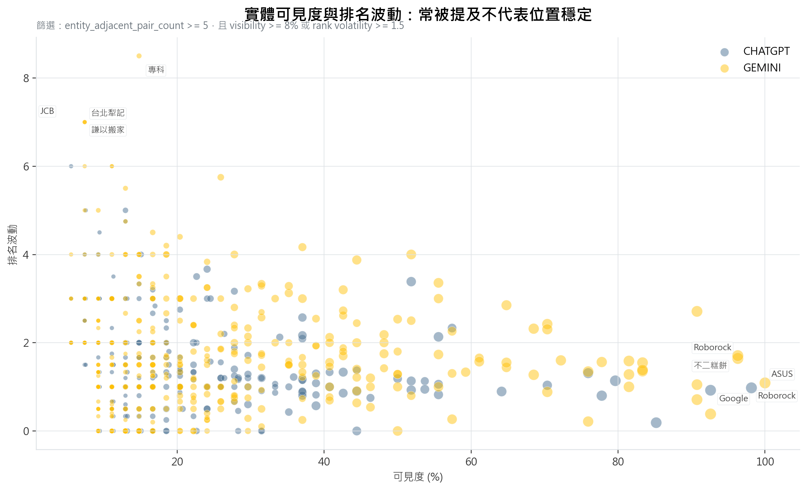
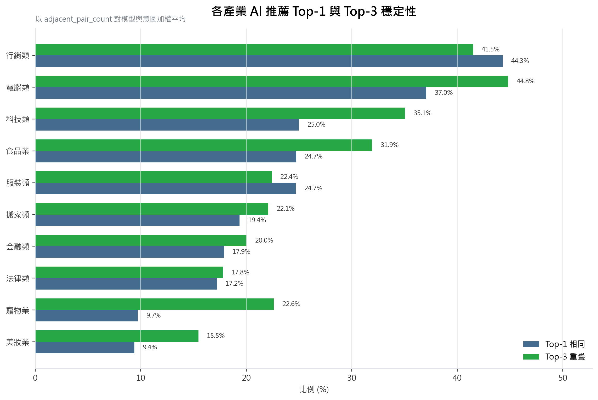

# AI 推薦品牌有排名可言嗎？3,237 次 ChatGPT 與 Gemini 回答的觀察

傳統 SEO 習慣追蹤第 1 名、第 2 名與排名升降。但 AI Search 的回答不是搜尋結果頁。它會把問題改寫成搜尋字、選擇 citation 來源、組合候選品牌 / 產品 / 平台實體，最後用一段回答呈現。這讓一個實務問題變得很重要：如果同一個 prompt 每天重跑，AI 推薦的名單與順序會一致嗎？

這份研究用 10 個產業、3 種 prompt 意圖、2 個模型與 6 天追蹤來回答這個問題。結果很直接：AI 回答中的候選集合有部分可追蹤訊號，但單次回答的排名順序不適合被當成傳統搜尋排名解讀。

## 我們怎麼做

研究期間是 2026-04-27 至 2026-05-02。資料來自內部 GEO tracking system，公開包只保留聚合統計與圖表，不包含原始 AI 回應、SQLite 資料庫、內部 target id、run id、完整 URL inventory 或 API 憑證。

研究設計：

| 項目 | 設計 |
| --- | ---: |
| 產業 | 10 |
| 每產業 keyword | 9 |
| 每產業 prompt | 27 |
| 意圖 | 推薦型、比較型、知識型 |
| 模型 | ChatGPT、Gemini |
| 追蹤天數 | 6 |
| 設計樣本 | 3,240 筆 AI 回應 |
| 有效分析樣本 | 3,237 筆 AI 回應 |

每則回答會抽取品牌 / 產品 / 平台 / 網站 / 服務等實體提及。本文為了可讀性，有時簡稱為「品牌提及」，但實際上它更接近「AI 回答中的候選實體」。`PTT`、`Dcard`、`SSD`、`Windows` 這類平台或產品類別在本研究中會保留，因為它們反映 AI 回答如何組裝推薦與解釋。

排名順序一致性使用同一產業、同一模型、同一意圖、同一 prompt 的相鄰日期作比較。`mentions_json` 是保留順序的 list，本研究把它視為回答內實體出現 / 抽取順序的近似依據，而不是重新從原始全文定位字元位置。

## 發現一：完全相同的推薦順序很少出現

最嚴格的檢查是「相鄰兩天是否產生完全相同且順序一致的實體名單」。這個比例非常低。

資料來源：`data/aggregated/L1_ordered_consistency_by_model_intent.csv`

整體加權結果：

| 指標 | 整體加權結果 |
| --- | ---: |
| 完全同序率 | 4.10% |
| 同集合不看順序 | 4.59% |
| Top-1 相同率 | 24.10% |
| Top-3 平均重疊 | 28.51% |
| 實體集合 Jaccard | 25.43% |

這代表 AI 推薦答案不是穩定的排名頁。即使同一個 prompt、同一個模型，隔天的名單與順序也常常會變。

## 發現二：Top-1 比完整排序穩，但仍不足以單次判斷

如果只看第一個被提到的實體，穩定性比完整排序高很多。Gemini 推薦型的 Top-1 相同率是 28.57%，ChatGPT 推薦型是 24.47%。但這仍然代表大多數相鄰日比較中，第一個被提到的實體並不相同。

所以追蹤 AI Search 時，不應把「今天排第一」直接理解成品牌取得穩定領先。更好的問題是：

- 它在多次回答中是否經常出現？
- 它是否常進入 Top-3？
- 它的位置是否大幅漂移？
- 它背後的 citation domain 是否穩定？

## 發現三：常被提到，不代表位置穩定

有些實體 visibility 很高，但排名位置仍會變動。這對品牌監測很重要：高出現率代表 AI 知道你，但不代表 AI 每次都把你放在同一個位置。

資料來源：`data/aggregated/L3_entity_visibility_rank_stability.csv`

這張圖用 x 軸表示 visibility，也就是某實體在分析樣本中被提及的比例；y 軸表示 rank volatility，也就是相鄰日期中同一實體位置變動的幅度。右側但偏高的點，代表實體很常出現，但位置不穩。右側且偏低的點，才比較接近「穩定候選」。

## 發現四：產業差異很大

產業之間的 Top-1 與 Top-3 穩定性差異明顯。行銷類、電腦類與科技類的候選位置相對更穩；美妝、寵物、法律等產業則更容易波動。

資料來源：`data/aggregated/L2_ordered_consistency_by_industry_model_intent.csv`

這表示 AI visibility 監測不應只套同一套 benchmark。規格型、品牌候選池明確的產業，可能比較容易形成穩定候選名單；服務型、情境型或高度依賴評價 / 地區 / 條件的產業，名單與順序更容易漂移。

## 發現五：排名只是其中一層，citation 來源也要一起看

AI 回答不是只把品牌排序。它還會選擇 citation domain 建立證據。既有研究表顯示，品牌 / 產品 / 平台實體名單穩定性與 citation domain 穩定性是兩個不同測量層。

有些產業候選品牌相對穩定，但 citation domain 每天輪替；有些產業則相反，AI 使用的來源池比較穩，但品牌候選名單變動較大。這代表 GEO 監測至少要分成兩層：

- 候選實體層：誰被提到、出現率多少、是否進 Top-3、位置是否漂移。
- 證據來源層：AI 引用哪些 domain、來源類別是否穩定、官方 / 媒體 / 評測 / 社群 / 平台各自扮演什麼角色。

## 行銷人應該追什麼

如果只追單次回答的第 1 名，很容易誤判。比較穩健的 AI Search visibility 指標應該包含：

| 指標 | 用途 |
| --- | --- |
| Visibility % | 品牌 / 產品 / 平台實體是否常被提到 |
| Top-3 overlap | 候選集合是否在多次回答中重複 |
| Top-1 stability | 第一個被提到的實體是否穩定 |
| Rank volatility | 同一實體出現時位置是否大幅漂移 |
| Entity set Jaccard | 同一 prompt 的候選集合是否相似 |
| Citation domain stability | 支撐答案的來源池是否穩定 |

這些指標比單次排名更接近 AI Search 的實際行為。

## 結論

AI Search 不適合被當成傳統排名系統追蹤。單次回答中的第 1 名、第 2 名，很可能只是一次生成結果中的暫時排序。比較可靠的做法，是重複追蹤同一批 prompt，觀察品牌 / 產品 / 平台實體是否穩定進入候選集合、是否常出現在 Top-3、位置是否漂移，以及支撐這些回答的 citation domain 是否穩定。

對 GEO 實務而言，重點不是「今天 AI 把我排第幾」，而是「在多次生成與多個模型中，AI 是否持續把我放進可見候選池，並且是否有穩定的公開來源支撐這個判斷」。

## 研究限制

- 本研究是 2026-04-27 至 2026-05-02 的靜態快照，不代表即時 AI Search 結果。
- Prompt 以繁體中文使用情境為主，不代表其他語言市場。
- `mentions_json` 的順序被用作回答內實體出現順序的近似，不是 raw response 字元位置重建。
- 實體名稱未做完整 alias 合併，因此 `ECOVACS` / `Ecovacs`、`Anessa` / `ANESSA` 等可能分開計算。
- 公開包不含原始 AI 回應、SQLite 資料庫、完整 URL inventory、內部 run id 或客戶版產業報告。

## 延伸閱讀

- SparkToro, "New Research: AIs Are Highly Inconsistent When Recommending Brands or Products; Marketers Should Take Care When Tracking AI Visibility", 2026-01-27.

