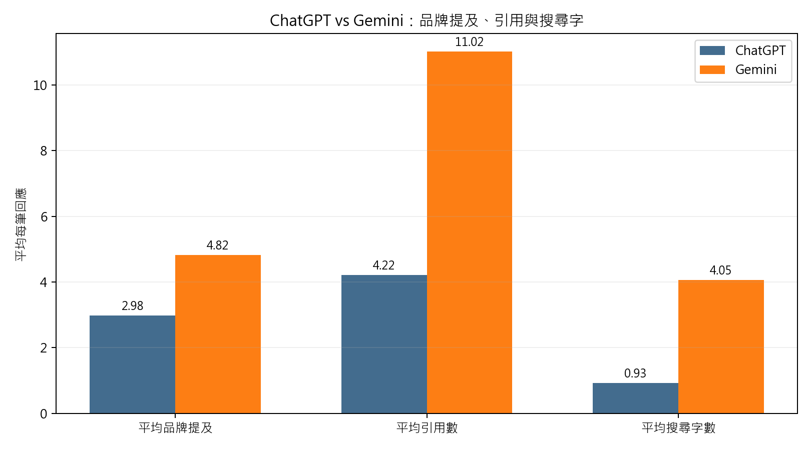
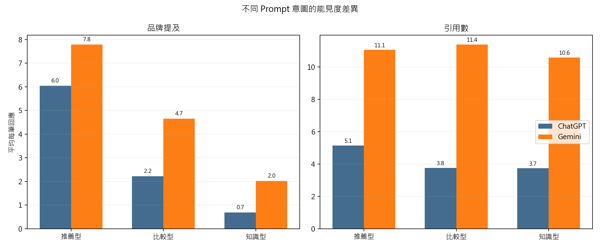
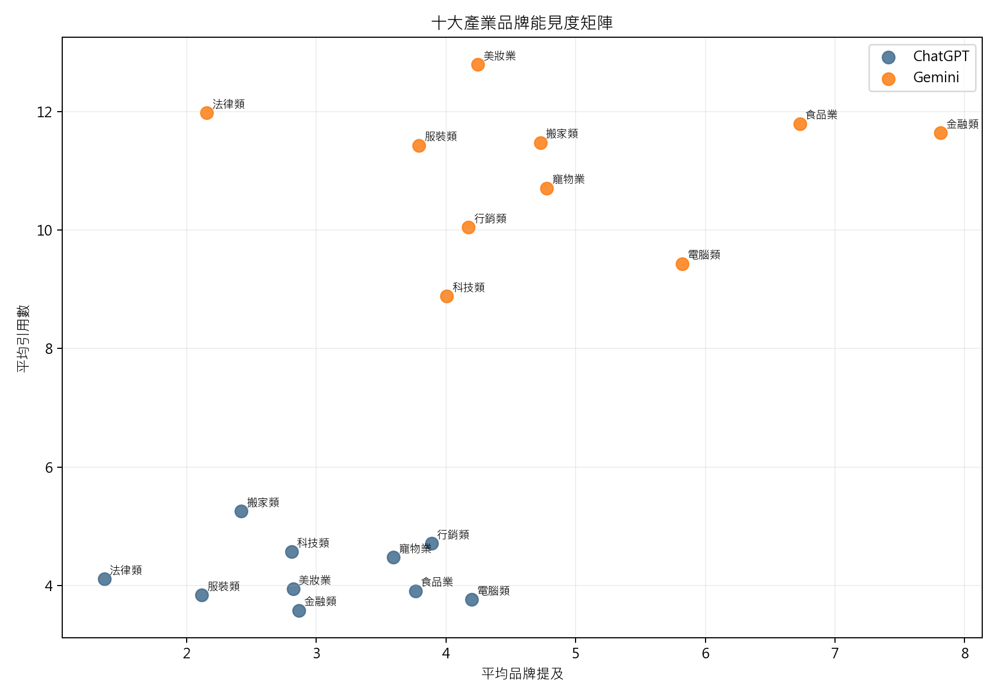

# AI Search 品牌能見度研究：ChatGPT 與 Gemini 的品牌提及、引用來源與跨日穩定性

**研究期間**：2026-04-27 至 2026-05-02  
**研究產業**：科技、法律、金融、行銷、搬家、服裝、寵物、美妝、食品、電腦  
**模型**：ChatGPT、Gemini  
**資料量**：研究設計量 3,240 筆；新版公開統整採 3,237 筆有效分析樣本  
**資料口徑**：公開版提供聚合統計、全產業統整分析、圖表與結論對照表；不公開客戶版產業報告、原始 AI 回應、資料庫、內部 ID 或執行憑證。

## 摘要（Abstract）

本研究觀察生成式 AI 搜尋系統在品牌推薦、比較與知識型問題中的可見度分配。研究以 10 個產業、3 種 prompt 意圖、2 個模型與 6 天連續觀測為設計，分析品牌 / 產品 / 平台實體提及數、引用來源類別、搜尋字語系、引用 domain 穩定性、實體名單穩定性與模型差異。為了維持表格可讀性，後文將品牌、產品、平台、網站與服務等商業實體提及簡稱為「品牌提及」。

新版資料顯示，Gemini 的平均引用數約為 ChatGPT 的 2.61 倍，平均品牌提及約為 ChatGPT 的 1.62 倍。推薦型問題最接近 AI 候選名單，知識型問題則更常反映 AI 建立信任標準時依賴哪些來源。品牌能見度不能只看品牌官網是否被引用，而要同時觀察官方、評測、媒體、社群、平台與其他公開來源如何共同支撐 AI 回答。

## 研究問題與貢獻

1. ChatGPT 與 Gemini 在品牌提及、引用數與來源類別上是否存在穩定差異？
2. 推薦型、比較型、知識型 prompt 是否會觸發不同的品牌候選池與引用來源池？
3. AI 回答出現品牌提及時，引用來源類別是否與未提及品牌時不同？
4. 同一組產業與 prompt 經過多日追蹤後，品牌名單與引用 domain 是否具備可監測的跨日穩定性？

相較於單次截圖式觀察，本研究把 AI Search 能見度拆成「品牌 / 產品 / 平台實體是否被提及」「引用來源來自哪裡」「搜尋字如何被改寫」「實體名單與來源是否跨日穩定」四個可量化層次，作為 GEO 監測的實證基礎。

## Practical Implications

- **不要只看品牌官網**：AI 回答會同時依賴官方、評測、媒體、社群與平台來源。
- **推薦型是候選名單入口**：品牌是否被 AI 穩定點名，最適合先從推薦型 prompt 監測。
- **比較型建立定位**：比較型 prompt 會迫使 AI 說明價格、功能、限制、資格或情境差異。
- **知識型建立信任標準**：FAQ、流程、規格、風險與教學內容會影響 AI 如何理解品牌所在品類。
- **模型要分開看**：ChatGPT 與 Gemini 的引用密度和來源池不同，不能用單一模型代表全部 AI Search。

## 一、研究背景（Background）

AI Search 的回答不是單純把搜尋結果重新排序，而是把使用者問題拆成推薦、比較、知識、價格、規格、流程、風險與常見問題等資訊需求，再從公開網路中選擇來源組裝答案。品牌在 AI 回答中的能見度，因此同時受品牌候選池、引用來源池、內容格式與模型搜尋行為影響。

本研究選擇 10 個產業，是為了同時觀察商品型、服務型、專業型與在地需求型查詢：科技與電腦偏規格比較，金融偏產品條件，法律與行銷偏專業服務，搬家偏在地服務，美妝、服裝、寵物與食品偏消費推薦。

## 二、研究方法（Methodology）

### 2.1 樣本設計

本研究資料源自內部 GEO tracking system 的 SQLite 追蹤資料庫。研究樣本不是整個資料庫的全量資料，而是依 10 個產業 target 擷取 2026-04-27 至 2026-05-02 期間已完成的 AI Search runs。每個產業包含 9 個 keyword、27 組 prompt，並分為推薦型、比較型與知識型三種意圖。每組 prompt 在 ChatGPT 與 Gemini 上進行 6 天追蹤，理論設計量為 3,240 筆；清理未完成或缺失 runs 後，有效分析樣本為 3,237 筆。

資料表串接流程為：`geo_topic_clusters` 提供產業 target 與意圖群組，`geo_keywords` 提供 keyword，`geo_prompts` 提供 prompt 文字與排程設定，`geo_runs` 提供模型、日期、AI 回應、品牌 / 產品 / 平台實體提及、引用來源與搜尋字。公開版不發布原始回應文字、SQLite 資料庫、完整 URL inventory、內部 target id 或執行憑證，只發布聚合統計、圖表與結論對照表。

意圖分類以 `geo_topic_clusters.topic_name` 作為最終分組來源，並將同義標籤正規化，例如「推薦類型」合併為「推薦型」。因此公開統計中的推薦型、比較型與知識型，是以 topic cluster 層級分類，而非單純依 prompt 文字或 `geo_prompts.intent_tag` 判定。

### 2.2 產業與觀測主題

| 產業 | 觀測主題 | Runs | ChatGPT 品牌/引用 | Gemini 品牌/引用 |
| --- | --- | --- | --- | --- |
| 科技類 | 推薦型：平價掃地機器人推薦、掃地機器人推薦、有拖地功能掃地機器人推薦 比較型：掃地機器人 吸塵器 比較、掃地機器人品牌比較、掃拖機器人比較 知識型：掃地機器人好用嗎、掃地機器人怎麼選、掃地機器人適合木地板嗎 | 324 | 2.81 / 4.57 | 4.01 / 8.88 |
| 法律類 | 推薦型：台北車禍律師推薦、車禍律師推薦、車禍法律諮詢推薦 比較型：法律扶助 車禍律師 比較、車禍律師費用比較、車禍調解 和解 比較 知識型：車禍和解流程、車禍調解要準備什麼、車禍賠償怎麼算 | 324 | 1.36 / 4.11 | 2.15 / 11.98 |
| 金融類 | 推薦型：信用卡推薦、海外消費信用卡推薦、現金回饋信用卡推薦 比較型：信用卡回饋比較、信用卡年費比較、現金回饋 里程卡 比較 知識型：信用卡回饋怎麼算、信用卡循環利息是什麼、信用卡怎麼選 | 324 | 2.86 / 3.58 | 7.81 / 11.64 |
| 行銷類 | 推薦型：SEO 公司推薦、SEO 服務推薦、台北 SEO 公司推薦 比較型：SEO SEM 比較、SEO 公司比較、SEO 顧問 SEO 公司 比較 知識型：SEO 怎麼做、SEO 是什麼、關鍵字排名怎麼提升 | 323 | 3.89 / 4.71 | 4.17 / 10.04 |
| 搬家類 | 推薦型：便宜搬家公司推薦、台北搬家公司推薦、搬家公司推薦 比較型：回頭車 搬家公司 比較、搬家公司費用比較、自助搬家 搬家公司 比較 知識型：搬家前要準備什麼、搬家注意事項、搬家費用怎麼算 | 324 | 2.42 / 5.25 | 4.73 / 11.48 |
| 服裝類 | 推薦型：上班族洋裝推薦、洋裝推薦、顯瘦洋裝推薦 比較型：棉麻洋裝 雪紡洋裝 比較、洋裝品牌比較、長洋裝 短洋裝 比較 知識型：不同身形洋裝穿搭、洋裝尺寸怎麼選、洋裝怎麼搭 | 324 | 2.12 / 3.84 | 3.79 / 11.43 |
| 寵物業 | 推薦型：幼貓飼料推薦、無穀貓飼料推薦、貓飼料推薦 比較型：乾飼料 濕食 比較、無穀貓飼料比較、貓飼料品牌比較 知識型：貓一天吃多少飼料、貓咪換飼料方法、貓飼料怎麼選 | 324 | 3.59 / 4.48 | 4.78 / 10.70 |
| 美妝業 | 推薦型：敏感肌防曬乳推薦、開架防曬乳推薦、防曬推薦 比較型：物理防曬 化學防曬、開架防曬乳比較、防曬乳 防曬噴霧 比較 知識型：防曬乳怎麼選、防曬乳要卸妝嗎、防曬係數怎麼看 | 324 | 2.82 / 3.94 | 4.25 / 12.79 |
| 食品業 | 推薦型：中秋蛋黃酥推薦、台中蛋黃酥推薦、蛋黃酥推薦 比較型：蛋黃酥品牌比較、蛋黃酥 鳳梨酥 比較、蛋黃酥禮盒比較 知識型：蛋黃酥保存方式、蛋黃酥可以放多久、蛋黃酥熱量 | 323 | 3.76 / 3.91 | 6.73 / 11.79 |
| 電腦類 | 推薦型：大學生筆電推薦、文書筆電推薦、筆電推薦 比較型：MacBook Windows 筆電比較、文書筆電 電競筆電 比較、筆電品牌比較 知識型：筆電 SSD 是什麼、筆電規格怎麼看、筆電記憶體多少夠用 | 323 | 4.20 / 3.76 | 5.82 / 9.43 |

### 2.3 指標定義

| 指標 | 定義 | 研究用途 |
| --- | --- | --- |
| 平均品牌提及 | 每則 AI 回答中偵測到的品牌 / 產品 / 平台 / 網站 / 服務等實體名稱數量；本文為可讀性簡稱為品牌提及 | 衡量 AI 候選實體池強度 |
| 平均引用數 | 每則 AI 回答附帶的引用來源數量 | 衡量模型使用證據池的密度 |
| 引用來源類別 | 以 citation domain 為單位分類為品牌 / 官方型、評測 / 部落格、新聞媒體、社群、電商 / 平台等 | 判斷 AI 依賴哪些來源建立答案 |
| 搜尋字語系 | 中文、英文、中英混合比例 | 判斷 AI 如何改寫使用者問題 |
| 相鄰日重疊率 | 同一 prompt 在相鄰兩天的集合 Jaccard overlap | 判斷實體名單、引用 domain、搜尋字是否可追蹤 |

引用來源分類與品牌提及抽取是兩個不同的測量層。品牌提及來自 AI 回答文字中的實體偵測；引用來源分類則來自 AI citation URL 的 domain。citation domain 會依公開網頁與 metadata 判定網站語系與網站類別，並參考 `geo_settings.db` 中的 domain 分類資料；若存在人工維護的 `admin_category`，公開報告優先採用人工分類，以降低自動分類誤差。

## 三、研究結果

### 3.1 情境一：整體模型差異

| 模型 | 有效樣本 | 平均品牌提及 | 平均引用數 |
| --- | --- | --- | --- |
| chatgpt | 1617 | 2.98 | 4.22 |
| gemini | 1620 | 4.82 | 11.02 |

Gemini 的引用密度明顯高於 ChatGPT，代表它在本研究設定下傾向用更寬的來源池支撐答案。這對 GEO 監測有直接影響：ChatGPT 適合追蹤較精簡的高頻來源池，Gemini 則需要追蹤更寬、更分散的來源網絡。

### 3.2 情境一：不同意圖的品牌與引用差異

| 模型 | 意圖 | 有效樣本 | 平均品牌提及 | 平均引用數 |
| --- | --- | --- | --- | --- |
| chatgpt | 推薦型 | 539 | 6.04 | 5.15 |
| chatgpt | 比較型 | 539 | 2.22 | 3.76 |
| chatgpt | 知識型 | 539 | 0.68 | 3.74 |
| gemini | 推薦型 | 540 | 7.79 | 11.06 |
| gemini | 比較型 | 540 | 4.65 | 11.40 |
| gemini | 知識型 | 540 | 2.03 | 10.59 |

推薦型問題是最接近「AI 候選名單」的觀測入口。ChatGPT 推薦型平均品牌提及為 6.04，知識型為 0.68；Gemini 推薦型平均品牌提及為 7.79，知識型為 2.03。如果品牌只追蹤知識型問題，會低估自己在推薦場景中的曝光；如果只追蹤推薦型問題，又會忽略 AI 建立信任標準時引用哪些內容。

### 3.3 情境二：各產業可見度差異

從產業層級看，商品型或候選清單明確的產業通常有較高品牌提及，例如金融、食品、寵物、美妝、服裝與電腦；服務型與專業服務型產業則更容易受到地區、資格、程序、費用與信任來源影響，例如法律、搬家與行銷。產業策略不能只複製同一套 SEO 或 GEO 模板。

### 3.4 情境三：各產業 × 各意圖類型

| 產業 | 模型 | 意圖 | 平均品牌提及 | 平均引用數 | 樣本數 |
| --- | --- | --- | --- | --- | --- |
| 科技類 | chatgpt | 推薦型 | 4.85 | 4.17 | 54 |
| 科技類 | chatgpt | 比較型 | 3.33 | 4.50 | 54 |
| 科技類 | chatgpt | 知識型 | 0.24 | 5.04 | 54 |
| 科技類 | gemini | 推薦型 | 5.11 | 9.30 | 54 |
| 科技類 | gemini | 比較型 | 4.11 | 8.57 | 54 |
| 科技類 | gemini | 知識型 | 2.80 | 8.78 | 54 |
| 法律類 | chatgpt | 推薦型 | 3.19 | 5 | 54 |
| 法律類 | chatgpt | 比較型 | 0.48 | 2.85 | 54 |
| 法律類 | chatgpt | 知識型 | 0.43 | 4.48 | 54 |
| 法律類 | gemini | 推薦型 | 4.93 | 10.59 | 54 |
| 法律類 | gemini | 比較型 | 0.74 | 11.50 | 54 |
| 法律類 | gemini | 知識型 | 0.80 | 13.83 | 54 |
| 金融類 | chatgpt | 推薦型 | 6.63 | 4.63 | 54 |
| 金融類 | chatgpt | 比較型 | 1.39 | 2.91 | 54 |
| 金融類 | chatgpt | 知識型 | 0.57 | 3.20 | 54 |
| 金融類 | gemini | 推薦型 | 9.81 | 11.26 | 54 |
| 金融類 | gemini | 比較型 | 8.76 | 13.24 | 54 |
| 金融類 | gemini | 知識型 | 4.87 | 10.41 | 54 |
| 行銷類 | chatgpt | 推薦型 | 9.02 | 6.83 | 53 |
| 行銷類 | chatgpt | 比較型 | 0.89 | 3.11 | 54 |
| 行銷類 | chatgpt | 知識型 | 1.85 | 4.22 | 54 |
| 行銷類 | gemini | 推薦型 | 7.61 | 10 | 54 |
| 行銷類 | gemini | 比較型 | 2.72 | 10.67 | 54 |
| 行銷類 | gemini | 知識型 | 2.19 | 9.46 | 54 |
| 搬家類 | chatgpt | 推薦型 | 6.63 | 6.20 | 54 |
| 搬家類 | chatgpt | 比較型 | 0.35 | 4.35 | 54 |
| 搬家類 | chatgpt | 知識型 | 0.28 | 5.20 | 54 |
| 搬家類 | gemini | 推薦型 | 11.31 | 11.33 | 54 |
| 搬家類 | gemini | 比較型 | 2.20 | 11.26 | 54 |
| 搬家類 | gemini | 知識型 | 0.67 | 11.83 | 54 |
| 服裝類 | chatgpt | 推薦型 | 2.67 | 5.22 | 54 |
| 服裝類 | chatgpt | 比較型 | 3.09 | 3.31 | 54 |
| 服裝類 | chatgpt | 知識型 | 0.59 | 2.98 | 54 |
| 服裝類 | gemini | 推薦型 | 6.28 | 10.83 | 54 |
| 服裝類 | gemini | 比較型 | 4.24 | 12.31 | 54 |
| 服裝類 | gemini | 知識型 | 0.85 | 11.13 | 54 |
| 寵物業 | chatgpt | 推薦型 | 7.59 | 5.17 | 54 |
| 寵物業 | chatgpt | 比較型 | 3.04 | 4.48 | 54 |
| 寵物業 | chatgpt | 知識型 | 0.15 | 3.78 | 54 |
| 寵物業 | gemini | 推薦型 | 7.44 | 10.52 | 54 |
| 寵物業 | gemini | 比較型 | 5.54 | 11.50 | 54 |
| 寵物業 | gemini | 知識型 | 1.35 | 10.09 | 54 |
| 美妝業 | chatgpt | 推薦型 | 5.80 | 4.69 | 54 |
| 美妝業 | chatgpt | 比較型 | 2.41 | 3.57 | 54 |
| 美妝業 | chatgpt | 知識型 | 0.26 | 3.57 | 54 |
| 美妝業 | gemini | 推薦型 | 7.31 | 12.85 | 54 |
| 美妝業 | gemini | 比較型 | 3.91 | 12.94 | 54 |
| 美妝業 | gemini | 知識型 | 1.52 | 12.57 | 54 |
| 食品業 | chatgpt | 推薦型 | 7.74 | 5.30 | 54 |
| 食品業 | chatgpt | 比較型 | 3.43 | 4.17 | 53 |
| 食品業 | chatgpt | 知識型 | 0.11 | 2.26 | 54 |
| 食品業 | gemini | 推薦型 | 11.26 | 14.56 | 54 |
| 食品業 | gemini | 比較型 | 7.81 | 13.28 | 54 |
| 食品業 | gemini | 知識型 | 1.11 | 7.54 | 54 |
| 電腦類 | chatgpt | 推薦型 | 6.37 | 4.30 | 54 |
| 電腦類 | chatgpt | 比較型 | 3.80 | 4.37 | 54 |
| 電腦類 | chatgpt | 知識型 | 2.40 | 2.60 | 53 |
| 電腦類 | gemini | 推薦型 | 6.87 | 9.35 | 54 |
| 電腦類 | gemini | 比較型 | 6.48 | 8.72 | 54 |
| 電腦類 | gemini | 知識型 | 4.11 | 10.22 | 54 |

這張表是最接近執行層的分析矩陣。它說明同一個產業在推薦型、比較型與知識型問題中，品牌提及與引用密度並不相同。實務上應先找出「品牌提及高但引用來源不穩」或「引用密度高但品牌提及低」的格子，再決定要補品牌候選內容、比較內容，還是補知識型信任內容。

### 3.5 引用來源類別總覽

| 引用類別 | 引用數 | 占比 |
| --- | --- | --- |
| 品牌 / 官方型來源 | 10,061 | 40.8% |
| 評測 / 部落格 / KOL | 4,792 | 19.4% |
| 新聞媒體 | 4,201 | 17.0% |
| 電商 / 平台 | 2,710 | 11.0% |
| 社群媒體 | 2,066 | 8.4% |
| 其他來源 | 831 | 3.4% |

整體來看，AI Search 使用的是混合證據池：品牌 / 官方型來源提供事實校準，評測 / 部落格提供比較與使用情境，新聞媒體提供外部背書，社群媒體補足真實經驗，電商 / 平台補足價格、評價與轉換訊號。因此，品牌若只經營首頁與產品頁，通常不足以覆蓋 AI 生成答案所需的完整證據。

### 3.6 產業引用來源主導型態

| 產業 | 第 1 引用來源 | 第 2 引用來源 | 第 3 引用來源 | 判讀 |
| --- | --- | --- | --- | --- |
| 科技類 | 評測 / 部落格 / KOL（32.6%） | 新聞媒體（22.2%） | 品牌 / 官方型來源（20.4%） | 第三方與媒體資料主導 |
| 法律類 | 品牌 / 官方型來源（72.9%） | 評測 / 部落格 / KOL（10.7%） | 其他來源（9.0%） | 官方/品牌資料主導 |
| 金融類 | 評測 / 部落格 / KOL（40.0%） | 新聞媒體（25.2%） | 品牌 / 官方型來源（23.6%） | 第三方與媒體資料主導 |
| 行銷類 | 品牌 / 官方型來源（79.6%） | 評測 / 部落格 / KOL（10.2%） | 新聞媒體（3.6%） | 官方/品牌資料主導 |
| 搬家類 | 品牌 / 官方型來源（70.6%） | 評測 / 部落格 / KOL（10.5%） | 電商 / 平台（7.2%） | 官方/品牌資料主導 |
| 服裝類 | 品牌 / 官方型來源（26.0%） | 電商 / 平台（23.6%） | 新聞媒體（18.8%） | 官方/品牌資料主導 |
| 寵物業 | 品牌 / 官方型來源（33.0%） | 評測 / 部落格 / KOL（24.4%） | 電商 / 平台（24.0%） | 官方/品牌資料主導 |
| 美妝業 | 品牌 / 官方型來源（33.7%） | 新聞媒體（33.0%） | 電商 / 平台（13.2%） | 官方/品牌資料主導 |
| 食品業 | 新聞媒體（34.0%） | 評測 / 部落格 / KOL（25.1%） | 品牌 / 官方型來源（16.1%） | 第三方與媒體資料主導 |
| 電腦類 | 品牌 / 官方型來源（25.5%） | 社群媒體（21.2%） | 評測 / 部落格 / KOL（19.0%） | 官方/品牌資料主導 |

這張表是本研究最重要的產業差異之一。食品業的第一引用來源是新聞媒體，其次才是評測 / 部落格與品牌 / 官方型來源，代表 AI 在蛋黃酥與伴手禮查詢中高度依賴榜單、媒體報導、節慶推薦與外部編輯內容。相對地，法律類與行銷類的第一引用來源都是品牌 / 官方型來源，表示 AI 在專業服務查詢中更常回到律所、服務商、官方知識頁、服務介紹與案例頁建立答案。

這個差異意味著：食品、美妝、服裝、寵物等消費型產業，不能只補官網資料，還要經營媒體、評測、社群與平台證據；法律、行銷、搬家等服務型產業，官網內容的結構化程度、服務頁可信度、FAQ、案例、流程與費用說明會更直接影響 AI 引用。

### 3.7 模型引用來源偏好

| 模型 | 引用類別 | 引用數 | 占比 |
| --- | --- | --- | --- |
| chatgpt | 品牌 / 官方型來源 | 2,527 | 37.1% |
| chatgpt | 評測 / 部落格 / KOL | 2,184 | 32.0% |
| chatgpt | 新聞媒體 | 1,136 | 16.7% |
| chatgpt | 社群媒體 | 105 | 1.5% |
| chatgpt | 電商 / 平台 | 546 | 8.0% |
| chatgpt | 其他來源 | 318 | 4.7% |
| gemini | 品牌 / 官方型來源 | 7,534 | 42.2% |
| gemini | 評測 / 部落格 / KOL | 2,608 | 14.6% |
| gemini | 新聞媒體 | 3,065 | 17.2% |
| gemini | 社群媒體 | 1,961 | 11.0% |
| gemini | 電商 / 平台 | 2,164 | 12.1% |
| gemini | 其他來源 | 513 | 2.9% |

模型差異會改變來源治理優先順序。ChatGPT 的引用池較精簡，單一類別或少數高頻 domain 的影響可能更明顯；Gemini 的引用池較廣，除了官方與媒體來源，也更需要留意社群、平台與大量第三方內容。

### 3.8 AI 回答提及品牌時的引用偏好

| 模型 | 品牌提及狀態 | 回答數 | 引用數 | 每回答引用數 | 最高引用類別 |
| --- | --- | --- | --- | --- | --- |
| chatgpt | 有品牌提及 | 943 | 4,441 | 4.71 | 品牌 / 官方型來源（34.8%） |
| chatgpt | 無品牌提及 | 674 | 2,375 | 3.52 | 品牌 / 官方型來源（41.4%） |
| gemini | 有品牌提及 | 1248 | 13,860 | 11.11 | 品牌 / 官方型來源（38.9%） |
| gemini | 無品牌提及 | 372 | 3,985 | 10.71 | 品牌 / 官方型來源（53.9%） |

這張表用「回答是否有品牌提及」切開引用來源。它的意義是：當 AI 願意把品牌放進答案時，背後通常不是只依賴品牌官網，而是同時調用第三方評測、媒體、社群與平台。官網負責提供可被驗證的事實，第三方內容負責提供可比較、可推薦、可背書的語境。

### 3.9 搜尋字語系與改寫行為

| 模型 | 搜尋字數 | 中文 | 英文 | 中英混合 |
| --- | --- | --- | --- | --- |
| chatgpt | 1497 | 72.1% | 0.9% | 27.0% |
| gemini | 6569 | 68.4% | 10.7% | 20.9% |

搜尋字語系顯示 AI 如何把繁體中文 prompt 轉成可搜尋需求。若模型產生大量中英混合或英文搜尋字，品牌就不能只看中文官網內容，也要檢查英文品牌名、型號、國際評測、平台頁與英文媒體是否會影響候選名單。

### 3.10 搜尋字跨日穩定性

| 模型 | 意圖 | 搜尋字相鄰日重疊率 |
| --- | --- | --- |
| chatgpt | 推薦型 | 23.8% |
| chatgpt | 比較型 | 16.2% |
| chatgpt | 知識型 | 18.8% |
| gemini | 推薦型 | 3.6% |
| gemini | 比較型 | 5.7% |
| gemini | 知識型 | 4.5% |

搜尋字穩定度越高，代表固定頁型和固定主題更容易承接 AI 搜尋需求；搜尋字越分散，代表需要內容叢集，而不是單頁文章。新版產業報告普遍顯示 Gemini 搜尋字更分散，因此 Gemini 的優化更依賴廣覆蓋的內容組合。

### 3.11 引用 domain 跨日穩定性

| 模型 | 意圖 | 引用 domain 相鄰日重疊率 |
| --- | --- | --- |
| chatgpt | 推薦型 | 23.1% |
| chatgpt | 比較型 | 20.9% |
| chatgpt | 知識型 | 19.7% |
| gemini | 推薦型 | 28.2% |
| gemini | 比較型 | 25.7% |
| gemini | 知識型 | 25.5% |

引用 domain 的跨日重疊率通常低於品牌名單穩定性，代表 AI 每天可能替換不同來源，但仍維持相似的來源類型與候選邏輯。因此，GEO 監測不應只看單一 URL 是否被引用，而要看高頻 domain、來源類別與跨日穩定的候選集合。

### 3.12 品牌名單跨日穩定性

| 模型 | 意圖 | 品牌名單相鄰日重疊率 |
| --- | --- | --- |
| chatgpt | 推薦型 | 29.4% |
| chatgpt | 比較型 | 28.9% |
| chatgpt | 知識型 | 22.2% |
| gemini | 推薦型 | 34.4% |
| gemini | 比較型 | 25.3% |
| gemini | 知識型 | 19.5% |

品牌名單穩定性用來判斷 AI 是否已形成相對固定的候選集合。推薦型問題通常最適合追蹤品牌是否進入候選名單；比較型和知識型則適合追蹤 AI 如何建立評價框架與信任標準。

### 3.13 排名順序一致性

品牌名單穩定性使用集合重疊率，判斷同一 prompt 跨日是否出現相似的品牌 / 產品 / 平台實體；排名順序一致性則保留回答內的實體出現順序，進一步比較相鄰日期是否產生相同排序、相同第一名、相似 Top-3 候選集合，以及同一實體的排名位置是否漂移。因此，本文不將單次回答中的第 1 名視為傳統搜尋排名，而是將多次回答中的 visibility、Top-3 overlap 與 rank volatility 作為較穩健的 AI Search 追蹤指標。

| 模型 | 意圖 | 相鄰日比較組數 | 完全同序 | 同集合不看順序 | Top-1 相同 | Top-3 平均重疊 |
| --- | --- | ---: | ---: | ---: | ---: | ---: |
| chatgpt | 推薦型 | 425 | 1.65% | 2.35% | 24.47% | 33.33% |
| chatgpt | 比較型 | 288 | 6.60% | 6.94% | 19.79% | 21.93% |
| chatgpt | 知識型 | 181 | 14.36% | 14.36% | 25.97% | 24.40% |
| gemini | 推薦型 | 448 | 0.67% | 1.12% | 28.57% | 34.56% |
| gemini | 比較型 | 386 | 2.85% | 3.89% | 21.50% | 26.68% |
| gemini | 知識型 | 297 | 5.72% | 5.72% | 23.23% | 23.74% |

整體來看，相鄰日完全相同且順序一致的比例很低，加權後約 4.10%；即使不看順序、只要求候選集合完全相同，也只有約 4.59%。這表示 AI Search 的推薦答案不適合用單次排名解讀。相對地，Top-1 相同率約 24.10%，Top-3 平均重疊約 28.51%，代表 AI 在候選集合層仍有部分可追蹤訊號，但需要用重複觀測而不是單次截圖判斷。

### 3.14 10 產業品牌名單與引用網站穩定性比較

| 產業 | 品牌名單穩定性 | 引用 domain 穩定性 | 品牌 - domain 差距 | 判讀 |
| --- | --- | --- | --- | --- |
| 行銷類 | 46.5% | 24.5% | 21.9% | 候選品牌比引用網站更穩定 |
| 電腦類 | 42.8% | 18.7% | 24.1% | 候選品牌比引用網站更穩定 |
| 科技類 | 39.1% | 23.6% | 15.6% | 候選品牌比引用網站更穩定 |
| 食品業 | 29.4% | 26.1% | 3.2% | 引用網站相對穩定或兩者接近 |
| 法律類 | 23.1% | 27.8% | -4.7% | 引用網站相對穩定或兩者接近 |
| 金融類 | 19.4% | 28.3% | -8.9% | 引用網站比品牌名單更穩定 |
| 搬家類 | 19.3% | 23.8% | -4.5% | 引用網站相對穩定或兩者接近 |
| 寵物業 | 17.6% | 23.2% | -5.6% | 引用網站比品牌名單更穩定 |
| 服裝類 | 15.2% | 20.2% | -5.0% | 引用網站相對穩定或兩者接近 |
| 美妝業 | 13.9% | 22.4% | -8.6% | 引用網站比品牌名單更穩定 |

這張表把 10 個產業放在同一個穩定性框架下比較。科技、行銷、電腦等產業的品牌名單穩定性高於引用 domain 穩定性，表示 AI 對「候選品牌是誰」相對有固定集合，但每天引用哪個網站仍會替換。食品業的品牌名單穩定性也高於引用 domain，代表蛋黃酥推薦名單有一定可追蹤性，但媒體、榜單與評測來源會輪替。

相反地，法律、金融、搬家、服裝、寵物、美妝等產業的引用 domain 穩定性接近或高於品牌名單穩定性，代表 AI 可能更穩定地使用某些來源池，但品牌候選名單每天仍會受問題情境、地區、資格、價格、評價或產品條件影響而變動。這類產業不能只追蹤「有沒有被提名」，也要追蹤高頻來源池是否持續可見。

### 3.15 跨產業高頻 domain

| Domain | 引用數 | 涵蓋產業數 | 主要來源類別 |
| --- | --- | --- | --- |
| vocus.cc | 615 | 10 | 社群媒體 |
| youtube.com | 261 | 10 | 社群媒體 |
| dcard.tw | 260 | 10 | 社群媒體 |
| en.wikipedia.org | 174 | 10 | 評測 / 部落格 / KOL |
| zh.wikipedia.org | 149 | 10 | 評測 / 部落格 / KOL |
| uptogo.com.tw | 144 | 10 | 評測 / 部落格 / KOL |
| pixnet.net | 375 | 9 | 社群媒體 |
| line.me | 231 | 9 | 社群媒體 |
| udn.com | 179 | 9 | 新聞媒體 |
| reddit.com | 95 | 9 | 社群媒體 |
| ettoday.net | 82 | 9 | 新聞媒體 |
| forbes.com | 45 | 9 | 新聞媒體 |
| taobao.com | 337 | 8 | 電商 / 平台 |
| my-best.com | 156 | 8 | 評測 / 部落格 / KOL |
| womenshealthmag.com | 338 | 7 | 新聞媒體 |

跨產業 domain 的存在表示部分網站或平台具有「AI 來源入口」角色。這些 domain 不一定都適合所有品牌合作，但它們提醒我們：AI Search 的來源池會跨越傳統產業邊界，媒體、平台、社群與大型內容站可能在多個產業同時扮演證據節點。

## 四、產業別統整解讀

### 4.1 科技類與電腦類

科技類與電腦類都屬於規格與比較密度高的商品型查詢。AI 不只需要品牌和型號，也需要價格、效能、使用情境、保固、維修、耗材或週邊限制。這類產業應優先建立可引用的選購指南、比較表、規格說明與 FAQ，並確保第三方評測和媒體內容能正確描述產品定位。

### 4.2 金融類

金融類的品牌與產品候選非常多，Gemini 特別容易展開較長的候選清單。這類產業的 AI 可見度不只取決於銀行官網，還取決於比較平台、媒體、部落格與申辦 / 通路頁是否清楚呈現回饋條件、年費、限制、海外消費、資格與風險。

### 4.3 法律類與行銷類

法律與行銷屬於專業服務型查詢。AI 回答不一定只列名單，而會先建構「怎麼選、費用怎麼看、流程怎麼走、什麼情況適合找誰」的判斷框架。這類品牌應補足服務頁、知識文章、案例、費用說明、比較框架與第三方信任訊號。

### 4.4 搬家類

搬家類高度依賴地區、價格、評價、流程與注意事項。AI 會需要搬家公司官網、生活服務平台、評價文章與在地化資訊。品牌若只做首頁曝光，容易無法覆蓋「便宜、台北、估價、注意事項、流程」等具體查詢情境。

### 4.5 服裝、美妝、寵物與食品

這四類消費型產業都具有強烈的推薦與比較需求。AI 會同時看品牌、通路、評測、社群、成分 / 材質 / 口味、使用者評價與適用情境。內容策略應以情境頁、比較頁、成分或規格說明、FAQ、第三方評測與社群口碑共同建立。

## 五、討論與建議

### 5.1 模型差異的 GEO 策略含義

ChatGPT 的來源池較精簡，適合追蹤高頻 domain、推薦型候選名單與核心引用類別。Gemini 的來源池較廣，適合追蹤內容覆蓋面、社群與平台訊號，以及大量中長尾來源是否正確呈現品牌資訊。

### 5.2 意圖類型的優化方向差異

推薦型用來追蹤是否進入候選名單；比較型用來追蹤 AI 是否理解品牌定位與差異；知識型用來追蹤 AI 建立信任標準時引用哪些內容。三者缺一不可。

### 5.3 內容投資比例建議

公開資料支持一個基本方向：品牌官網 / 內容中心、第三方評測 / 部落格、新聞媒體 / 編輯內容、社群影音 / 問答、平台 / 通路都應被納入 GEO 來源治理。實際比例應依產業調整；商品型產業更重視評測、平台與社群，專業服務型產業更重視官網知識頁、案例、名錄與可信第三方內容。

## 六、結論

本研究顯示，AI Search 品牌能見度應被視為一組可監測的系統，而不是單一排名。品牌需要同時追蹤：是否被 AI 提及、在哪些意圖中被提及、與哪些來源類別一起出現、引用 domain 是否跨日穩定，以及不同模型是否使用不同來源池。

對實務而言，GEO 的核心不是只讓官網被引用，而是建立一個能被 AI 反覆使用的證據網絡。這個網絡包含官方事實、第三方比較、媒體背書、社群經驗、平台資料與清楚的 FAQ。只有當這些內容能同時覆蓋推薦、比較與知識型問題，品牌才更可能在 AI Search 中形成穩定可見度。

## 七、研究限制與資料可用性

- 本研究是 2026-04-27 至 2026-05-02 的靜態快照，不代表即時 AI Search 結果。
- Prompt 以繁體中文使用情境為主，不代表其他語言市場。
- 本文為了可讀性使用「品牌提及」作為簡稱；實際偵測範圍包含品牌、產品、平台、網站、服務與部分商業實體名稱。
- 引用來源分類是研究標籤，正式決策前仍需逐頁確認來源角色。
- 公開包不含原始 AI 回應全文、SQLite 資料庫、完整 URL inventory 或內部執行 ID。
- `data/aggregated/` 提供聚合統計，`data/rosetta/` 提供結論到證據表的對照。

## 附錄：公開資料表索引

| 檔案 | 用途 |
| --- | --- |
| `public_model_metrics_by_industry.csv` | 各產業 × 模型的品牌提及與引用數 |
| `public_model_intent_metrics_by_industry.csv` | 各產業 × 模型 × 意圖的品牌提及與引用數 |
| `public_citation_category_by_industry_model_intent.csv` | 引用類別分布 |
| `C_brand_mention_s1_category.csv` | 品牌提及狀態與引用類別關係 |
| `public_domain_stability_by_industry_intent.csv` | 引用 domain 跨日穩定性 |
| `public_brand_stability_by_industry_intent.csv` | 品牌名單跨日穩定性 |
| `public_search_keyword_language_by_industry.csv` | 搜尋字語系分析 |
| `L1_ordered_consistency_by_model_intent.csv` | 模型 × 意圖的排名順序一致性 |
| `L2_ordered_consistency_by_industry_model_intent.csv` | 產業 × 模型 × 意圖的排名順序一致性 |
| `L3_entity_visibility_rank_stability.csv` | 實體出現率、平均位置與排名波動 |

## References

本公開稿保留研究報告形式，正式投稿前應依目標期刊或研討會格式補齊引用格式、英文摘要、圖表標題與相關研究段落。
